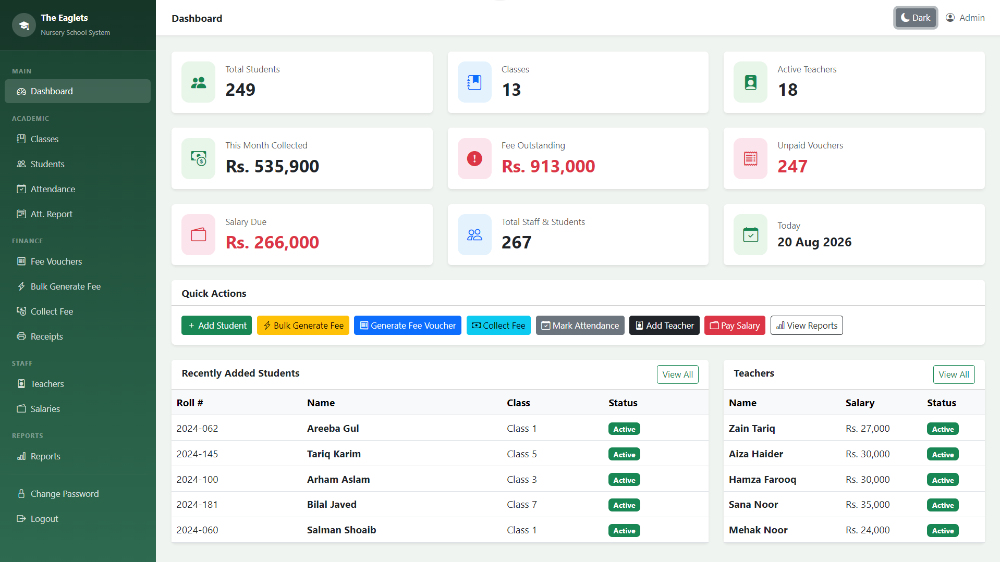
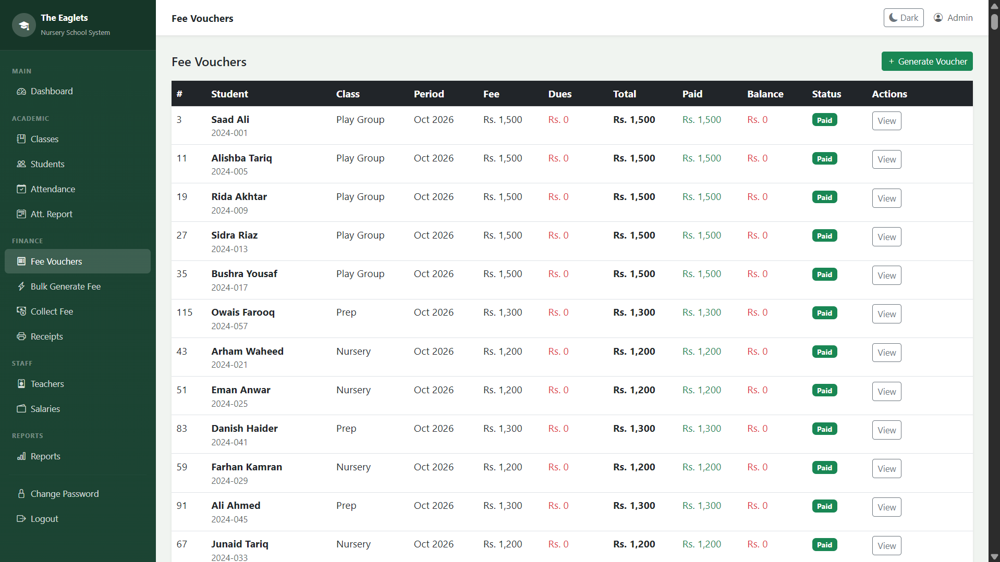
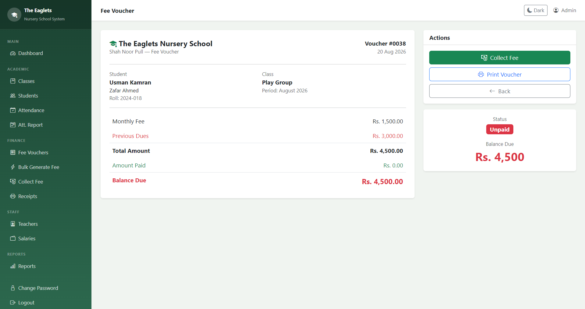
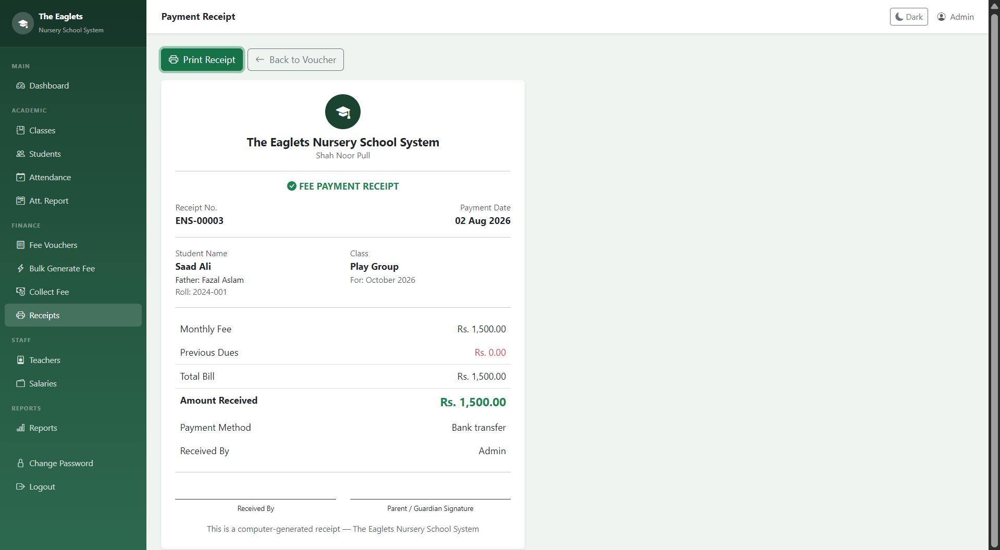
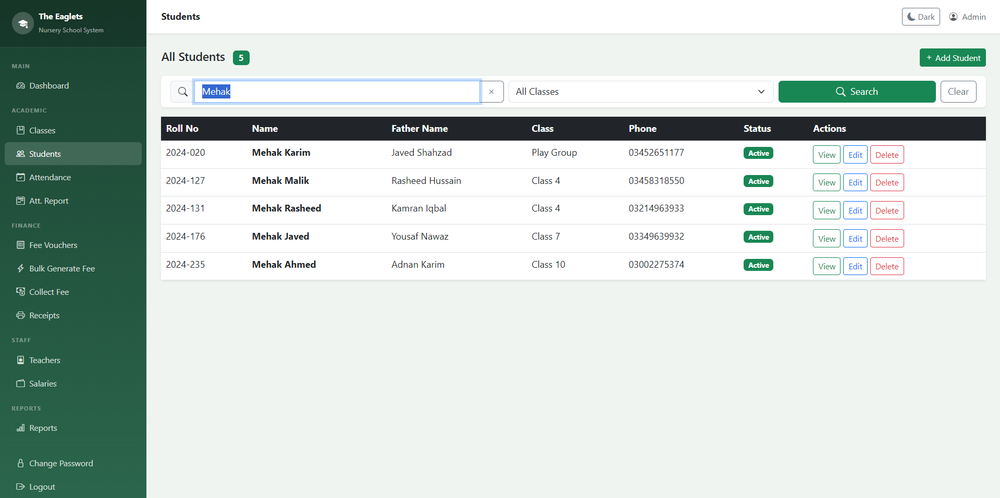

# 🏫 School Fee & Attendance Management System

A comprehensive school management system built with **PHP, MySQL, and Bootstrap 5** — designed to help small schools manage student records, fee collection, attendance, and teacher salaries from a single dashboard.


---

## 📖 Overview

This project was originally built as a real client project for a nursery school, and has since been refactored, bug-fixed, and cleaned up as a standalone portfolio piece. It handles the day-to-day operations of a small school — from enrolling students and collecting monthly fees to tracking attendance and paying teacher salaries.

## ✨ Features

- 📊 **Dashboard** — real-time overview of total students, active teachers, monthly fee collection, outstanding dues, and salary due
- 🏫 **Classes** — manage class list with custom monthly fees (Play Group through Class 10)
- 👨‍🎓 **Students** — full CRUD with search by name, roll number, father's name, or phone; class-wise filtering
- 🧾 **Fee Vouchers** — generate individual or bulk monthly vouchers, track previous dues automatically, support partial payments and advance balances
- 💵 **Fee Collection & Receipts** — collect payments via cash, bank transfer, or cheque, and print clean receipts
- 📅 **Attendance** — mark daily attendance by class with quick "All Present" / "All Absent" actions, plus monthly attendance reports
- 👩‍🏫 **Teachers & Salaries** — manage teacher records and process monthly salary payments (full or partial), with printable salary receipts
- 📈 **Reports** — monthly fee collection summary and outstanding dues report
- 🌗 **Dark / Light mode** — toggle that persists across sessions

## 🖥️ Screenshots

| Dashboard | Fee Vouchers |
|---|---|
|  |  |

| Voucher Detail (Unpaid / Partial Tracking) | Payment Receipt |
|---|---|
|  |  |

**Student Search**


## 🛠️ Tech Stack

- **Backend:** PHP (procedural, `mysqli` with prepared statements)
- **Database:** MySQL
- **Frontend:** Bootstrap 5, Bootstrap Icons, vanilla JavaScript
- **Environment:** XAMPP (Apache + MySQL)

## 🚀 Setup

1. Clone this repository into your `htdocs` folder:
   ```bash
   git clone https://github.com/Rifaqajmal/school-fee-attendance-management-system.git
   ```
2. Start **Apache** and **MySQL** in XAMPP.
3. Open **phpMyAdmin**, go to the **SQL** tab, and run the full contents of `database/school_fee_system.sql`. This creates the database, all 8 tables, the default class list, an admin login, and a set of realistic demo data (250+ students, 18 teachers, and a mix of paid / partial / unpaid fee vouchers) so the dashboard looks populated right away.
4. Visit `http://localhost/school-fee-attendance-management-system/` in your browser.
5. Log in with:
   - **Username:** `admin`
   - **Password:** `password`

## 🗄️ Database Schema

8 tables: `users`, `classes`, `students`, `fee_vouchers`, `fee_payments`, `teachers`, `salary_payments`, `attendance` — with foreign keys and unique constraints to prevent duplicate vouchers, duplicate salary records, and duplicate attendance entries per day.

## 📝 Notes

The demo data included in the SQL file is entirely fictional and for demonstration purposes only.

## 📄 License

This project is open source and available for learning purposes.
